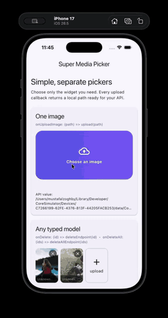
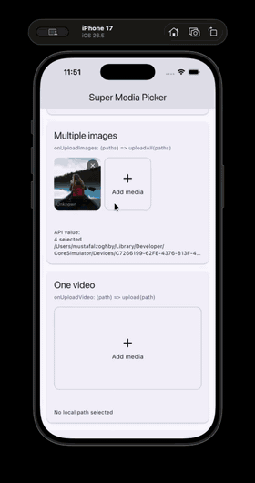
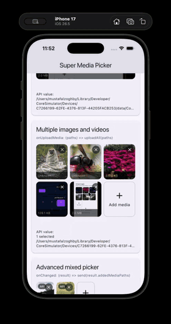
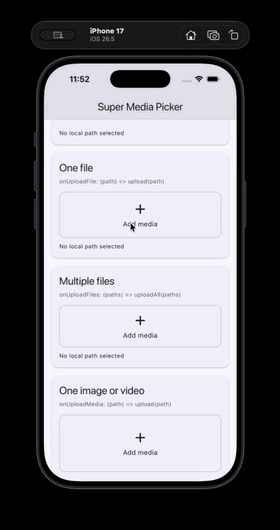

# Media Picker Manager

A configurable Flutter media picker **and media manager** for create/edit forms. It combines local selections and existing API media in one controller and clearly reports what was added and which remote items were removed.

## Features

- Single/multiple images, videos, and files
- Independent single/multiple behavior for each media type
- Camera, gallery, and native file browser
- Existing remote/API images, videos and files
- Track `addedItems`, `existingItems`, and `removedItems`
- Remove/restore API items without losing their IDs
- Per-image/video/file size limits
- Total size and per-type item limits
- Image picker quality + max width/height
- Video duration configuration
- File extension filtering
- Human readable sizes: `5.mb`, `500.kb`, `1.gb`
- Upload progress state in the controller
- Optional async `transform` hook for custom image/video compression
- Custom item/add/empty builders
- Configurable outer frame and custom container builder
- Grid and list layouts
- Automatic long-press drag-and-drop sorting when more than one item exists
- Tap images for a zoomable full-screen preview
- Tap videos for full-screen playback with seeking and play/pause controls
- Video tiles show a supplied thumbnail or automatically display the first frame
- Automatic device-language labels with RTL support and locale overrides
- No networking library is forced on your app

## Demo

<table>
  <tr>
    <th>Image</th>
    <th>Multiple images</th>
    <th>Media</th>
    <th>Multiple media</th>
  </tr>
  <tr>
    <td></td>
    <td></td>
    <td></td>
    <td></td>
  </tr>
</table>

## Install

```bash
flutter pub add media_picker_manager
```

Or add it manually:

```yaml
dependencies:
  media_picker_manager: ^0.1.0
```

The package automatically installs `image_picker`, `file_picker`, `cross_file`,
and `video_player`. Do not add those dependencies manually unless your app uses
them directly.

## Required project setup

### iOS

Add the permissions used by your app to `ios/Runner/Info.plist`. When using the
default picker sources, add all three:

```xml
<key>NSPhotoLibraryUsageDescription</key>
<string>We need photo-library access so you can choose images and videos.</string>
<key>NSCameraUsageDescription</key>
<string>We need camera access so you can take photos and record videos.</string>
<key>NSMicrophoneUsageDescription</key>
<string>We need microphone access when recording videos.</string>
```

- `NSPhotoLibraryUsageDescription` is required for gallery images and videos.
- `NSCameraUsageDescription` is required only when camera capture is enabled.
- `NSMicrophoneUsageDescription` is required only when video recording is
  enabled.
- Use iOS 12 or newer. The included example targets iOS 13.
- HTTPS API media needs no extra network configuration. For plain HTTP URLs,
  configure App Transport Security for only the domains your app trusts.

### Android

This package requires Android SDK 24 or newer. In
`android/app/build.gradle.kts`:

```kotlin
android {
    defaultConfig {
        minSdk = 24
    }
}
```

Add internet access to `android/app/src/main/AndroidManifest.xml` when showing
remote API images or videos:

```xml
<manifest xmlns:android="http://schemas.android.com/apk/res/android">
    <uses-permission android:name="android.permission.INTERNET" />
    <application ...>
        <!-- your existing application configuration -->
    </application>
</manifest>
```

No storage permission and no `requestLegacyExternalStorage` setting are needed.
The system photo picker and file picker handle access to user-selected files.

### macOS (when targeted)

Add these entries to both `macos/Runner/DebugProfile.entitlements` and
`macos/Runner/Release.entitlements`:

```xml
<key>com.apple.security.files.user-selected.read-only</key>
<true/>
<key>com.apple.security.network.client</key>
<true/>
```

The filesystem entitlement enables user-selected images/files. The network
client entitlement is needed when displaying remote API media.

After changing platform configuration, rebuild the application:

```bash
flutter clean
flutter pub get
flutter run
```

## Easy API: choose one widget

Each media use case has its own widget. Single widgets return one `String`
path; multiple widgets return the `List<String>` selected in that picker
action.

```dart
// One image
SuperImagePicker(
  width: double.infinity,
  height: 180,
  alignment: AlignmentDirectional.centerStart,
  onUploadImage: (path) => uploadImage(path),
)

// Multiple images
SuperImagesPicker(
  onUploadImages: (paths) => uploadImages(paths),
)

// One video
SuperVideoPicker(
  width: double.infinity,
  height: 220,
  onUploadVideo: (path) => uploadVideo(path),
)

// Multiple videos
SuperVideosPicker(
  onUploadVideos: (paths) => uploadVideos(paths),
)

// One file
SuperFilePicker(
  width: double.infinity,
  height: 96,
  onUploadFile: (path) => uploadFile(path),
)

// Multiple files
SuperFilesPicker(
  onUploadFiles: (paths) => uploadFiles(paths),
)

// One image or video
SuperSingleMediaPicker(
  onUploadMedia: (path) => uploadMedia(path),
)

// Multiple images and videos
SuperMultipleMediaPicker(
  onUploadMedia: (paths) => uploadMedia(paths),
)
```

The single image, video, file, and mixed-media widgets expose `width`, `height`,
and `alignment` directly. They use one grid column, so
`width: double.infinity` fills the parent. The default alignment is
`AlignmentDirectional.centerStart`, which follows LTR and RTL direction.

Replace the default upload frame with any Flutter design. Your custom widget
must call `openPicker` when it is tapped:

```dart
SuperImagePicker(
  width: double.infinity,
  height: 180,
  addButtonBuilder: (context, openPicker) => Material(
    color: Colors.indigo,
    borderRadius: BorderRadius.circular(24),
    child: InkWell(
      onTap: openPicker,
      borderRadius: BorderRadius.circular(24),
      child: const Center(
        child: Text(
          'Choose an image',
          style: TextStyle(color: Colors.white),
        ),
      ),
    ),
  ),
  onUploadImage: uploadImage,
)
```

This completely removes the built-in add icon, border, and text for that
picker. Use `itemBuilder` when you also want to completely replace the design
of selected or initial media. Both builders are available on every simple
image, video, file, and mixed-media picker.

Multiple pickers expose count, quality, and size controls directly:

```dart
SuperImagesPicker(
  maxItems: 6,
  quality: 75, // 0..100
  maxWidth: 1600,
  maxHeight: 1600,
  maxSizeBytes: 5.mb,       // each image
  maxTotalSizeBytes: 20.mb, // all selected images
  onUploadImages: uploadImages,
)

SuperVideosPicker(
  initialVideos: const [
    'https://flutter.github.io/assets-for-api-docs/assets/videos/bee.mp4',
  ],
  maxItems: 4,
  maxSizeBytes: 100.mb,       // each video
  maxTotalSizeBytes: 300.mb,  // all selected videos
  maxDuration: const Duration(minutes: 5),
  onUploadVideos: uploadVideos,
)

SuperFilesPicker(
  maxItems: 5,
  maxSizeBytes: 10.mb,
  maxTotalSizeBytes: 40.mb,
  onUploadFiles: uploadFiles,
)

SuperMultipleMediaPicker(
  maxItems: 8,
  maxImages: 6,
  maxVideos: 2,
  imageQuality: 75,
  imageMaxSizeBytes: 5.mb,
  videoMaxSizeBytes: 100.mb,
  maxTotalSizeBytes: 300.mb,
  onUploadMedia: uploadMedia,
)
```

`maxItems` is intentionally available only on multiple widgets. Image quality
and dimensions are passed to the native image picker. Flutter's native video
picker does not provide a video-quality parameter; use the async `transform`
callback with your preferred video compressor when you need to change video
quality. Size limits are checked after picking and after `transform` finishes.

Pass `initialImage`, `initialImages`, `initialVideo`, `initialVideos`,
`initialFile`, `initialFiles`, or `initialMedia` to show existing local or API
data. Every simple widget also accepts `config` for frame, size, text, icons,
layout, preview, limits, language, and RTL settings.

All pickers are generic. `T` can be any developer model without casting to
`Object`. Multiple initial values accept any `Iterable<T>`, including a `List`
or `Set`:

```dart
class Images {
  Images(this.id, this.image);
  final int id;
  final String image;
}

final List<Images> images = await api.getImages();

SuperImagesPicker<Images>(
  initialImages: images,
  initialItemMapper: (image, index) => SuperMediaItem.remote(
    id: image.id.toString(),
    url: image.image,
  ),
  onDelete: (id) async {
    await api.deleteImage(id);
  },
  onDeleteAll: (ids) async {
    await api.deleteImages(ids);
  },
  onUploadImages: (paths) => uploadImages(paths),
)
```

`onDelete` is called when one remote initial item is removed. `onDeleteAll` is
called when multiple remote items are removed in one controller operation.
Local selections never call delete endpoints. For a custom delete-all button:

```dart
final controller = SuperMediaController<Images>(
  initialItems: images,
  initialItemMapper: (image, index) => SuperMediaItem.remote(
    id: image.id.toString(),
    url: image.image,
  ),
);

SuperImagesPicker<Images>(
  controller: controller,
  onDelete: (id) => api.deleteImage(id),
  onDeleteAll: (ids) => api.deleteImages(ids),
)

ElevatedButton(
  onPressed: controller.deleteAllItems,
  child: const Text('Delete all'),
)

@override
void dispose() {
  controller.dispose();
  super.dispose();
}
```

A controller is optional. Use it when another button or form action must read
or change picker state: delete all, delete by ID, inspect the final result,
restore an API item, or update upload progress. For simple upload and remove
callbacks alone, no controller is required.

Use the same typed `initialItemMapper` with image, video, file, single-media,
multiple-media, or the advanced `SuperMediaPicker<T>`. Models with recognized
map keys or `toJson()` continue to work without a mapper.

The upload callbacks contain only files chosen in the latest picker action. To
read every local file currently visible after adding, removing, or reordering,
use `onChanged`:

```dart
SuperImagesPicker(
  onUploadImages: (newPaths) => uploadImages(newPaths),
  onChanged: (result) {
    final allImagePaths = result.addedImagePaths;
  },
)
```

## Advanced media manager

Use `SuperMediaPicker` directly only when one widget must combine images,
videos, generic files, existing API data, and deletion tracking:

```dart
final controller = SuperMediaController(
  initialItems: [
    SuperMediaItem.remote(
      id: 'server-42',
      url: 'https://example.com/image.jpg',
      name: 'image.jpg',
      type: SuperMediaType.image,
    ),
  ],
);

SuperMediaPicker(
  controller: controller,
  config: SuperMediaPickerConfig(
    allowedTypes: const {
      SuperMediaType.image,
      SuperMediaType.video,
      SuperMediaType.file,
    },
    limits: SuperMediaLimits(
      maxItems: 10,
      maxImages: 6,
      maxVideos: 2,
      maxFiles: 3,
      maxTotalSizeBytes: 100.mb,
    ),
    image: SuperImageConfig(
      allowMultiple: true,
      maxSizeBytes: 5.mb,
      quality: 85,
      maxWidth: 1920,
      maxHeight: 1920,
    ),
    video: SuperVideoConfig(
      allowMultiple: false,
      maxSizeBytes: 50.mb,
      maxDuration: const Duration(minutes: 3),
    ),
    file: SuperFileConfig(
      allowMultiple: true,
      maxSizeBytes: 10.mb,
      allowedExtensions: const ['pdf', 'doc', 'docx', 'zip'],
    ),
  ),
  onChanged: (result) {
    print('Upload paths: ${result.addedMediaPaths}');
    print('Delete API IDs: ${result.removedItemIds}');
  },
)
```

## Control single and multiple selection

The global `allowMultiple` setting is the default. Each media type can override
it independently. Limits control how many items may remain in the controller:

```dart
const config = SuperMediaPickerConfig(
  allowMultiple: true,
  image: SuperImageConfig(allowMultiple: true),
  video: SuperVideoConfig(allowMultiple: false),
  file: SuperFileConfig(allowMultiple: true),
  limits: SuperMediaLimits(
    maxImages: 8,
    maxVideos: 1,
    maxFiles: 4,
  ),
);
```

For local and remote factory constructors, `name`, `type`, and `sizeBytes` are
optional. Name and type are inferred from the path or URL extension:

```dart
final image = SuperMediaItem.remote(
  id: 'server-42',
  url: 'https://example.com/uploads/image.jpg',
);
```

Use `initialItem` for one value and `initialItems` for a list. Both automatically
accept `SuperMediaItem`, URL strings, `Uri`, `File`, `XFile`, API maps, and
custom objects that implement `toJson()`:

```dart
SuperMediaPicker(
  initialItem: 'https://example.com/cover.jpg',
  initialItems: [
    'https://example.com/photo.jpg',
    {
      'id': 'api-video',
      'url': 'https://example.com/media/42',
      'type': 'video',
      'size': 1200,
      'thumbnailUrl': 'https://example.com/thumb.jpg',
    },
  ],
)
```

Use only the property that matches your data:

```dart
// One URL or one API object.
SuperMediaPicker(initialItem: apiMediaObject)

// A list of URLs or API objects.
SuperMediaPicker(initialItems: apiMediaList)
```

When both are provided they are combined, and duplicate IDs are included only
once.

Map keys are normalized, so camel case, snake case, spaces, and hyphens work.
Common aliases are recognized, including `url`, `mediaUrl`, `downloadUrl`,
`src`, `imageUrl`, `videoUrl`, `fileUrl`, `path`, `filePath`, `id`, `mediaId`,
`fileId`, `uuid`, `name`, `fileName`, `type`, `mediaType`, `mimeType`, `size`,
`sizeBytes`, `fileSize`, `duration`, and thumbnail/poster keys. The original
input object is retained in `SuperMediaItem.data`.

For example, this custom model needs no mapper:

```dart
class ApiMedia {
  ApiMedia(this.id, this.url);

  final String id;
  final String url;

  Map<String, Object?> toJson() => {
    'media_id': id,
    'image_url': url,
  };
}

SuperMediaPicker(initialItems: <ApiMedia>[...])
```

An opaque Dart object cannot be inspected at runtime. If it has neither a
recognized representation nor `toJson()`, use `initialItemMapper`; this lets
the picker receive any application-specific model safely:

```dart
SuperMediaPicker(
  initialItems: apiMedia,
  initialItemMapper: (value, index) {
    final media = value as ApiMedia;
    return SuperMediaItem.remote(
      id: media.id,
      url: media.url,
      type: media.isVideo ? SuperMediaType.video : SuperMediaType.image,
    );
  },
)
```

Provide `type` when the URL has no useful file extension, such as an API route
ending in `/media/42`, only when it is not an image. Extensionless remote URLs
default to images and use their ID as the fallback name:

```dart
final image = SuperMediaItem.remote(
  id: 'server-42',
  url: 'https://example.com/media/42',
);

final video = SuperMediaItem.remote(
  id: 'video-42',
  url: 'https://example.com/media/video/42',
  type: SuperMediaType.video,
);
```

- `allowMultiple` controls selection within one native picker action.
- The global `allowMultiple: false` also keeps the controller in its original
  single-item replacement mode; use a global value of `true` for mixed rules.
- `maxImages`, `maxVideos`, `maxFiles`, and `maxItems` control the collection.
- Set a maximum to `1` when only one item of that type may exist.

## Control the frame and container

Frame configuration controls dimensions, constraints, spacing, decoration,
alignment, clipping, grid proportions, and list item height:

```dart
SuperMediaPickerConfig(
  crossAxisCount: 4,
  gridItemAspectRatio: 4 / 3,
  listItemHeight: 110,
  spacing: 12,
  borderRadius: 18,
  frame: SuperMediaFrameConfig(
    width: 720,
    padding: EdgeInsets.all(16),
    margin: EdgeInsets.symmetric(vertical: 12),
    decoration: BoxDecoration(
      color: Colors.white,
      borderRadius: BorderRadius.all(Radius.circular(24)),
    ),
    clipBehavior: Clip.antiAlias,
  ),
)
```

For complete control, wrap the generated frame with `containerBuilder`:

```dart
SuperMediaPicker(
  containerBuilder: (context, child) => Card(
    elevation: 4,
    child: child,
  ),
)
```

Keep grid tiles at a fixed height even with four or six columns:

```dart
const SuperMediaPickerConfig(
  crossAxisCount: 4,
  gridItemHeight: 130,
)
```

Set the width, height, and alignment of every media tile and add button:

```dart
const SuperMediaPickerConfig(
  itemFrame: SuperMediaItemFrameConfig(
    width: 180,
    height: 130,
    alignment: Alignment.centerLeft,
  ),
)
```

In a grid, width is limited by the available column width. Use fewer columns
or a wider picker frame when the requested item width is larger than its cell.

Wrap the default item UI with a custom frame while preserving preview, remove,
upload progress, and drag behavior:

```dart
SuperMediaPicker(
  itemFrameBuilder: (context, item, index, child) => Container(
    padding: const EdgeInsets.all(3),
    decoration: BoxDecoration(
      border: Border.all(color: Theme.of(context).colorScheme.primary),
      borderRadius: BorderRadius.circular(20),
    ),
    child: child,
  ),
)
```

Control metadata separately for initial API items and uploaded local items:

```dart
const SuperMediaPickerConfig(
  showFileName: false,
  showFileSize: false,
  showLocalFileSize: true,
  showRemoteFileSize: false,
  showReorderHandle: false,
  showRemoteBadge: false,
)
```

Use `itemBuilder`, `addButtonBuilder`, and `emptyBuilder` to replace every
individual visual element.

## Control text and icons

All default text is configurable. Icons accept any Flutter `Widget`, so you can
use Material icons, SVG widgets, images, animations, or badges:

```dart
SuperMediaPickerConfig(
  text: SuperMediaTextConfig(
    images: 'Choose photos',
    videos: 'Choose videos',
    addMedia: 'Upload',
    remoteBadge: 'Saved',
  ),
  icons: SuperMediaIconConfig(
    images: MySvgIcon('assets/gallery.svg'),
    videos: Image.asset('assets/video.png', width: 24),
    addMedia: MyAnimatedUploadIcon(),
    remove: Icon(Icons.delete_outline, color: Colors.white),
  ),
)
```

## Device language and localization

The picker follows the device locale automatically. English, Arabic, French,
Spanish, German, and Turkish are included, with English as the fallback.
Arabic, Persian, Hebrew, and Urdu locales automatically use RTL layout.

Force a locale when the app has its own language selector:

```dart
const SuperMediaPickerConfig(locale: Locale('ar'))
```

Force layout direction independently from language when needed:

```dart
const SuperMediaPickerConfig(
  textDirection: TextDirection.rtl,
)
```

Add or replace any language without changing the package:

```dart
const SuperMediaPickerConfig(
  locale: Locale('it'),
  translations: {
    'it': SuperMediaTextConfig(
      images: 'Immagini',
      takePhoto: 'Scatta una foto',
      videos: 'Video',
      recordVideo: 'Registra video',
      files: 'File',
      addMedia: 'Carica media',
      remoteBadge: 'Salvato',
      unknownSize: 'Sconosciuto',
      unableToDisplayMedia: 'Impossibile mostrare il contenuto',
      unableToPlayVideo: 'Impossibile riprodurre il video',
    ),
  },
)
```

Passing a normal `text: SuperMediaTextConfig(...)` uses one fixed set of labels
regardless of device language.

## Drag-and-drop sorting

Sorting is enabled by default and activates automatically when the controller
contains more than one item. The reorder icon is hidden by default. Long-press
an item and drag it onto another item to reorder it in either grid or list
layout.

```dart
const config = SuperMediaPickerConfig(
  enableReorder: true,
  // Optional: display a visible drag handle.
  showReorderHandle: true,
);
```

Set `enableReorder: false` to lock the order. If the optional handle is enabled,
it accepts any widget through `SuperMediaIconConfig.reorder`.

## Full-screen image and video preview

Preview is enabled by default. Tap an image to open a zoomable full-screen
viewer, or tap a video to open the player with play, pause, and seek controls.

```dart
const config = SuperMediaPickerConfig(enablePreview: true);
```

Set `enablePreview: false` to disable the built-in viewer. Use
`previewBuilder` to supply a completely custom preview screen:

```dart
SuperMediaPicker(
  previewBuilder: (context, item) => MyMediaViewer(item: item),
)
```

Video tiles automatically initialize and display a paused frame from the video
itself, so a separate image is not required:

```dart
SuperMediaItem.remote(
  id: 'video-42',
  url: 'https://example.com/video.mp4',
)
```

`thumbnailUrl` and `thumbnailPath` remain optional for APIs that already return
a poster and want to avoid initializing every video while scrolling.

When placing pickers inside lazy lists, keep the controller in the parent
screen's state when possible. Pickers also use `keepAlive: true` by default so
lazy `ListView` and `GridView` parents do not dispose internally selected media.
Set `keepAlive: false` when deliberate disposal is preferable.

## Custom compression / processing

The package intentionally does not force a compression dependency. Attach any compressor you want through `transform`:

```dart
SuperVideosPicker(
  maxItems: 4,
  transform: (item) async {
    // Compress item.file with your preferred package.
    // Return a copy containing the compressed path and size.
    return compressedItem;
  },
)
```

This also works for video compression, metadata extraction, renaming, encryption, or any custom pre-upload pipeline.

## Updating an API

```dart
final result = controller.result;
final newLocalFiles = result.addedItems;
final remoteIdsToDelete = result.removedItems.map((e) => e.id).toList();
```

Delete one visible item by API ID or delete everything:

```dart
controller.deleteItemById('api-2');
controller.deleteAllItems();

// Send these IDs to your delete endpoint.
final idsToDelete = controller.result.removedItemIds;
```

The package tracks deletion intent but deliberately does not call your API.
Call your endpoint with `removedItemIds`, then submit or clear your form using
the networking solution already used by your application.

When `initialItems` gains a new API ID during a parent rebuild or hot reload,
the picker merges that item into its live controller automatically. Existing
selections are preserved, so adding `api-3` does not require restarting.

## Upload progress

Your own uploader can update the UI:

```dart
controller.setUploadProgress(item.id, 0.45);
controller.markUploaded(item.id);
```

## Platform setup

Because this package uses `image_picker`, add the normal camera/photo-library usage descriptions required by your iOS app. Android permissions/behavior depend on your target SDK and the underlying picker plugins. Check the current `image_picker` and `file_picker` platform setup when integrating into a production app.
